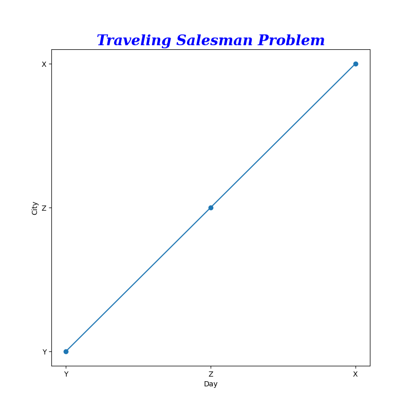

# Hopfield Network Visualizer 🧠

This tool is a graphical user interface (GUI) designed to visualize and interact with a Hopfield network, a type of recurrent artificial neural network used as a content-addressable memory system. The GUI provides a dynamic and interactive way to explore the network's behavior, including its state transitions, energy landscape, and pattern storage and retrieval capabilities.

This is an ongoing project, and the GUI is being developed to support educational purposes, allowing users to understand the network's dynamics and properties through visual feedback and interactive controls. Custom implementations of the Hopfield network's functionalities are used to provide a comprehensive and intuitive learning experience. For example, see the TSP (Travelling Salesman Problem) file for a Hopfield network implementation for the TSP.


<p align="center">
  
</p>

## Key Concepts 🗝️

- **Weights Matrix (J)**: Represents the connections between neurons. Jᵢⱼ denotes the weight between neurons i and j.
- **Neuron States (sᵢ)**: The state of neuron i, which can be either 1 or -1 (or 1 and 0 in the case of the TSP).
- **Energy**: Reflects the current state's stability. Lower energy indicates a more stable or converged state.
- **Overlap Value**: Measures the similarity between the network's current state and a stored pattern, aiding in pattern recognition.

## Features

- **Interactive Network Visualization**: Visualize the network's state, adjust it in real time, and observe how it evolves.
- **Pattern Management**: Add, store, and view patterns within the network to understand associative memory functionalities.
- **Dynamic Controls**: Utilize interactive buttons to manipulate the network's state, analyze its properties, and explore theoretical concepts.
- **Educational Insights**: Access detailed explanations and mathematical equations that underpin the network's operations, enhancing understanding of neural network dynamics.
- **Advanced Visualizations**: Explore the network in 3D and create GIFs to visualize the network's state changes over time.

<p align="center">
  

  

  

  
</p>

## How to Use 🛠️

1. **Initialization**: Launch the GUI to start with a Hopfield network of a specified size.
2. **Interaction**: Use the GUI buttons to interact with the network, applying operations like updating states, resetting, and storing patterns.
3. **Analysis**: Observe the network's behavior through visual feedback, understanding the impact of your interactions on its state and properties.

| Weights Before Training | Weights After Training |
|-------------------------|------------------------|
|  |  |

## Examples - Solving TSP 📚

<p align="center">
  

The Hopfield network can be used to solve the Travelling Salesman Problem (TSP), a classic optimization problem. The network is trained to find the shortest path that visits each city exactly once and returns to the original city. The TSP file contains a custom implementation of the Hopfield network for the TSP, allowing users to visualize the network's state transitions and energy landscape as it solves the problem, and to plot the route.

```python
def get_synaptic_matrix_with_constraints(self, dist=DIST) -> np.ndarray:
    """
    Calculate the synaptic matrix based on the custom Energy function with constraints designed for the TSP.
    """
    J = np.zeros((TSP_N, TSP_N, TSP_N, TSP_N+1)) # +1 for the bias
    for X, city in enumerate(CITIES):
        for i, day in enumerate(DAYS):
            for Y, city2 in enumerate(CITIES):
                for j, day2 in enumerate(DAYS):
                    J[X][i][Y][j] =  \
                        - A * Kronecker_delta(X, Y) * (1 - Kronecker_delta(i, j)) \
                        - B * Kronecker_delta(i, j) * (1 - Kronecker_delta(X, Y)) \
                        - C \
                        - D * DIST[city][city2] * (Kronecker_delta(i-1, j) + Kronecker_delta(i+1, j))
                    print(f'J{city}{day},{city2}{day2}: {J[X][i][Y][j]}')
                # Add the bias synapse to every neuron in the next layer
                J[X][i][Y][TSP_N] = TSP_N * C
    return J
```

The solution implementation was based on the litterature. The network energy function was designed to minimize the total distance of the route. Note that the network is not guaranteed to find the optimal solution, but it can provide a good approximation. Also note that no training is required for the TSP, as the network is initialized with synaptic weights that correspond to the problem's constraints.

<p align="center">
  
</p>

## Installation 📦

Ensure you have Python and necessary libraries (Matplotlib, NetworkX, PIL) installed. Clone the repository and run the script to launch the GUI.

## Contributing 🤝

Contributions are welcome! If you have suggestions for improvements or new features, please feel free to submit pull requests or open issues.

## License 📄

This project is licensed under the MIT License - see the [LICENSE.md](LICENSE.md) file for details.