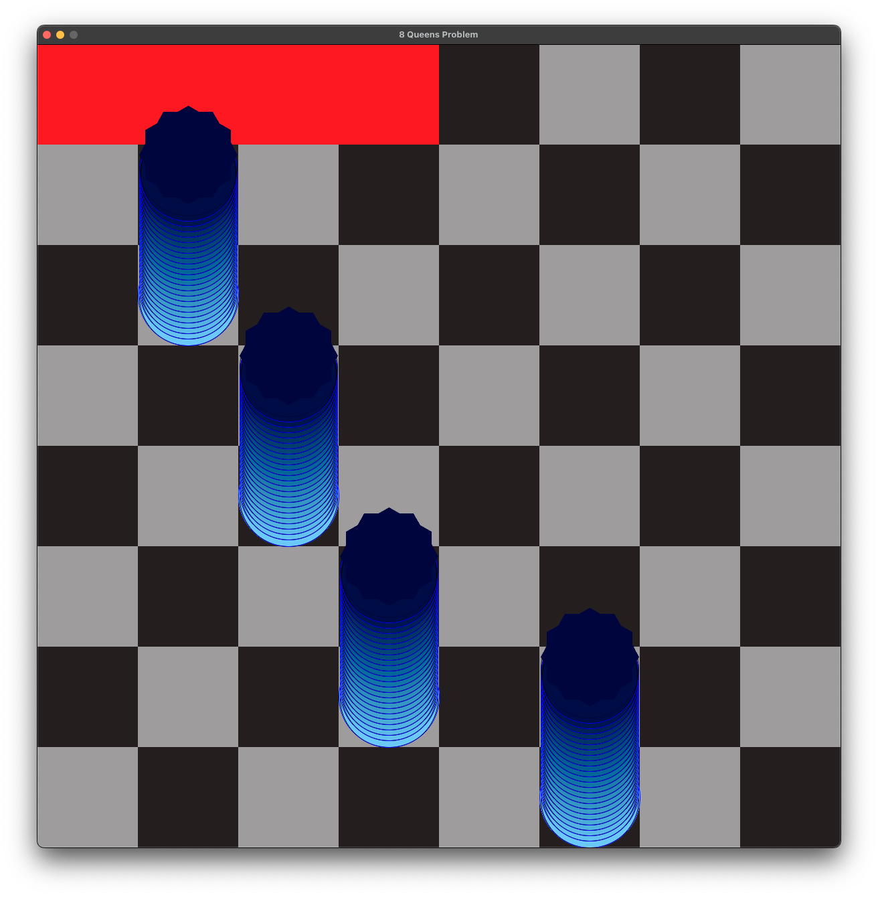

# Hopfield Dynamics Visualizer: NP-hard Edition 🧠

This tool is a graphical user interface (GUI) designed to visualize and interact with a Hopfield network, a type of recurrent artificial neural network used as a content-addressable memory system. The GUI provides a dynamic and interactive way to explore the network's behavior, including its state transitions, energy landscape, and pattern storage and retrieval capabilities.

This is an ongoing project, and the GUI is being developed to support educational purposes, allowing users to understand the network's dynamics and properties through visual feedback and interactive controls. Custom implementations of the Hopfield network's functionalities are used to provide a comprehensive and intuitive learning experience. For example, see the `TSP (Travelling Salesman Problem)` file for a Hopfield network implementation for the TSP, or the `N-Queens` file for a Hopfield network implementation for the N-Queens problem.

<p align="center">
  
  
  <br>
  <i>Visualizing the solution of the 8-Queens problem (left) and the Travelling Salesman Problem (right) using the Hopfield network</i>
</p>

---

- [Background](#background)
- [How to Use](#how-to-use)
- [Examples](#examples)
  - [N-Queens - New addition](#n-queens---new-addition)
  - [Solving TSP](#solving-tsp)
- [Installation](#installation)
- [Contributing](#contributing)
- [License](#license)
- [Gallery](#gallery)

---

## Background

The Hopfield network is a type of recurrent artificial neural network that serves as a content-addressable memory system. It was introduced by John Hopfield in 1982 and is based on the concept of associative memory, where patterns are stored in the network and can be retrieved based on partial or noisy inputs. The network consists of a set of interconnected neurons with symmetric weights, and it operates by updating the neuron states based on the input patterns and the network's energy function.

Key concepts of the Hopfield network include:

- **Weights Matrix (J)**: Represents the connections between neurons. Jᵢⱼ denotes the weight between neurons i and j. The following figure shows the weights before and after storing patterns in the network (training phase). Each square represents the weight between two neurons, with darker colors indicating connection strength.

  | Weights Before Storing Patterns | Weights After  Storing Patterns |
  |-------------------------|------------------------|
  |  |  |

- **Neuron States (sᵢ)**: The state of neuron i, which can be either 1 or -1 (or 1 and 0 in the case of the TSP). In the following GIF, yellow neurons represent state 1, and blue (dark) neurons represent state -1. Note that in addition, the synaptic weights are dynamically visualized, with thicker lines indicating stronger connections.

  <p align="center">
    
    <br>
    <i>Basic network inteface</i>
  </p>

- **Energy**: Reflects the current state's stability. Lower energy indicates a more stable or converged state.
- **Overlap Value**: Measures the similarity between the network's current state and a stored pattern, aiding in pattern recognition.
- **Diverse Applications**: The Hopfield network can be used for various tasks, including associative memory, optimization problems, and pattern recognition.

You can read more about the Hopfield network and its applications in the [wikipedia page](https://en.wikipedia.org/wiki/Hopfield_network).

---

The basic functionalities of the Hopfield Dynamics Visualizer include:

- **Interactive Network Visualization**: Visualize the network's state, adjust it in real time, and observe how it evolves.
- **Pattern Management**: Add, store, and view patterns within the network to understand associative memory functionalities.
  <p align="center">
    
    <br>
    The stored pattern (right) is updated in the network's synaptic weights (left) after training.
    <br>
    Note that the neurons are 0-indexed, and that the complete state is also stored (red).
    <br>
    
    
  </p>

- **Dynamic Controls**: Utilize interactive buttons to manipulate the network's state, analyze its properties, and explore theoretical concepts.
- **Educational Insights**: Access detailed explanations and mathematical equations that underpin the network's operations, enhancing understanding of neural network dynamics.
- **Advanced Visualizations**: Explore the network in 3D and create GIFs to visualize the network's state changes over time.

  <p align = "center">
    <i>Energy Landscape Visualization of the 8-Queens Problem using interpolation. Each dot represents a state, with the color indicating the energy level. Red dots represent global minimums. For more pictures see the gallery section.</i>
    <br>
    
    
    
  </p>

  <p align="center">
    Energy Function Visualization
    <br>
    

    
     <br>
    

    
  </p>

Note: This project is still under development, and some features may be incomplete or subject to change.

## How to Use

1. **Initialization**: Launch the GUI to start with a Hopfield network of a specified size.
2. **Interaction**: Use the GUI buttons to interact with the network, applying operations like updating states, resetting, and storing patterns.
3. **Analysis**: Observe the network's behavior through visual feedback, understanding the impact of your interactions on its state and properties.

For a custum implementation, you can add your own subclass of the `HopfieldNetwork` class and override the necessary methods to implement your desired functionality. Such as the following `TSP` example.

## Examples

### N-Queens - New addition

<p align="center">
  
  <br>
  <i>The new design of the GUI for the Hopfield network, featuring a clean and intuitive interface for interacting with the network.</i>
</p>

The latest addition to the project is the N-Queens problem, a classic combinatorial optimization problem that involves placing N queens on an N×N chessboard such that no two queens attack each other (see [Wikipedia](https://en.wikipedia.org/wiki/Eight_queens_puzzle)). The N-Queens problem is a well-known problem in computer science and artificial intelligence, and it can be solved using various algorithms, including constraint satisfaction, backtracking, and genetic algorithms. Note that the main difficulty in solving the N-Queens problem is not to find a solution but to find all possible solutions, or to find a solution given a specific initial state.

<p align="center">
  
  <br>
  <i>Trivial solution to the 8-Queens problem, where each queen is placed in a separate row and column.</i>
</p>

As can be seen in the following GIFs, the network is capable to solve the N-Queens problem for different board sizes.

<p align="center">
  
  
  <br>
  
  
  <br>
  <i>Visualizing the solution of the N-Queens problem using the Hopfield network for different board sizes: 8-Queens, 16-Queens, and 32-Queens. The network also solves the 64-Queens problem, but the visualization is not shown here due to space constraints.</i>
</p>

The Hopfield network can be used to solve the N-Queens problem by encoding the constraints of the problem in the network's energy function. The network is initialized with synaptic weights that correspond to the problem's constraints, and no training is required. The network's energy function is designed to minimize the number of conflicts between queens, resulting in a valid solution to the N-Queens problem.

```python
# from n_queens import NQueensNetwork
def get_synaptic_matrix(self):
    """Construct a synaptic matrix that penalizes queens threatening each other."""
    J = np.zeros((self.size, self.size, self.size, self.size))
    for i in range(self.size):
        for j in range(self.size):
            for k in range(self.size):
                for l in range(self.size):
                    if i != k or j != l:  # Skip the same queen
                        J[i, j, k, l] = (
                            -ROW_PENALTY *
                            Kronecker_delta(i, k) *
                            (1 - Kronecker_delta(j, l))
                            - COL_PENALTY *
                            (1 - Kronecker_delta(i, k)) *
                            Kronecker_delta(j, l)
                            - DIAG_PENALTY *
                            Kronecker_delta(abs(i - k), abs(j - l))
                        )
    return J
```

Or using `Pytorch` tensors:

```python

def get_synaptic_matrix(self):
    """Construct a synaptic matrix that penalizes queens threatening each other."""
    indices = torch.arange(self.size)
    i, j, k, l = torch.meshgrid(indices, indices, indices, indices)
    row_penalty = -ROW_PENALTY * (i == k) * (j != l)
    col_penalty = -COL_PENALTY * (i != k) * (j == l)
    diag_penalty = -DIAG_PENALTY * (abs(i - k) == abs(j - l))
    J = row_penalty + col_penalty + diag_penalty
    # Set diagonal elements to 0
    J[(i == k) & (j == l)] = 0
    return J
```

As shown in the code snippet above, the synaptic matrix is constructed to penalize queens that threaten each other. The network's energy function is designed to minimize the number of conflicts between queens, resulting in a valid solution to the N-Queens problem. The network can be visualized using the GUI, allowing users to interact with the network and observe its state transitions and energy landscape as it solves the N-Queens problem.

The energy function utilizes `tensors` to calculate the energy of a state, which is the sum of the interactions between queens. The energy is then normalized by dividing by 2, as each interaction is counted twice.

```python
def get_energy(self, s=None):
    """Calculate the energy of a state."""
    if s is None:
        s = self.s
    energy = torch.sum(self.J * torch.tensordot(s, s, dims=0))
    return -energy / 2  # Because each interaction is counted twice
```

The update rule for the network is based on the energy function, where the network transitions to a new state that minimizes the energy. The network employs `Simulated Annealing` through `asynchronous updates` to avoid getting stuck in local minima. The network will randomly select a neuron to update at each step, allowing it to explore different states and avoid getting stuck in local minima. The network is initialized with a random state. It will then converge to a valid solution for the N-Queens problem, where no two queens threaten each other, regardless of the initial state. This is achieved by applying an update only if the new state has lower energy, or with a probability that decreases with the energy difference and the temperature. The temperature is used to control the probability of accepting a worse state, which allows the network to explore different states and avoid getting stuck in local minima. The following code snippet shows the `next_state` method implementation using `numpy` arrays. For the newer `Pytorch` implementation, please check the `n_queens.py` file.

```python
def next_state(self, s=None, T=1.0):
    """
    Calculate the next state of the network
    """
    start_energy = self.get_energy()
    if start_energy == 0:
        print(f'Solution found in {self.external_iterations} ext iterations')
        return self.s
    s = self.s.copy()  # Create a copy of the state to avoid modifying the original state
    iterations = self.size ** 2 * 5

    for it in range(iterations):
        # Select a row at random
        i = np.random.randint(self.size)
        current_col = np.argmax(s[i])

        # Try moving the queen to a random column
        new_col = np.random.randint(self.size)
        s[i, current_col] = 0
        s[i, new_col] = 1
        new_energy = self.get_energy(s)

        # If the new state has lower energy, accept it
        # Otherwise, accept it with a probability that decreases with the energy difference and the temperature
        if new_energy < start_energy or np.random.rand() < np.exp((start_energy - new_energy) / T):
            start_energy = new_energy
        else:
            # Move the queen back to the original column
            s[i, new_col] = 0
            s[i, current_col] = 1

        if start_energy == 0:  # Optimal energy for 8 queens
            print(
                f'Solution found in {self.external_iterations} iterations')
            yield s.copy()
            break
        yield s.copy()


    self.external_iterations += 1
    self.neurons = s.flatten()
    self.s = s
    self.print_queens(s)
    return s
```

To see the network in action, run the `q_gui.py` file and interact with the GUI to observe the network's behavior as it solves the N-Queens problem. Note that in order to use this feature, you need to have the necessary libraries installed: pygame and pygame.gfxdraw, and one of the following libraries: numpy or Pytorch (for the newer implementation).

You can also run the N-Queens puzzle without the neural network by running the `q_light.py` file. This file contains an interactive graphical interface that allows you to place queens on the board and check for conflicts. Press a queen to pick it up, and press an empty square to place it.

<p align="center">
  
  
  <br>
  <i>Interactive graphical interface for the N-Queens puzzle without the neural network. Place queens on the board and check for conflicts.</i>

---

### Solving TSP

The Traveling Salesman Problem (TSP), or Hamiltonian cycle problem, is a classic optimization problem that is considered NP-hard. The problem involves finding the shortest possible route that visits each city exactly once and returns to the original city. The Hopfield network can be used to solve the TSP, providing a good approximation of the optimal solution in a reasonable amount of time. The network is initialized with synaptic weights that correspond to the problem's constraints, and no training is required. The network's energy function is designed to minimize the total distance of the route. The TSP file contains a custom implementation of the Hopfield network for the TSP, allowing users to visualize the network's state transitions and energy landscape as it solves the problem, and to plot the route.

<p align="center">
  
  <br>
  <i>Energy landscape visualization for the Travelling Salesman Problem. The weights were flattened to a 2D matrix for visualization purposes.</i>
</p>

The Hopfield network can be used to solve the Travelling Salesman Problem (TSP), a classic optimization problem. The network is trained to find the shortest path that visits each city exactly once and returns to the original city. The TSP file contains a custom implementation of the Hopfield network for the TSP, allowing users to visualize the network's state transitions and energy landscape as it solves the problem, and to plot the route.

```python
def get_synaptic_matrix_with_constraints(self, dist=DIST) -> np.ndarray:
    """
    Calculate the synaptic matrix based on the custom Energy function with constraints designed for the TSP.
    """
    J = np.zeros((TSP_N, TSP_N, TSP_N, TSP_N+1)) # +1 for the bias
    for X, city in enumerate(CITIES):
        for i, day in enumerate(DAYS):
            for Y, city2 in enumerate(CITIES):
                for j, day2 in enumerate(DAYS):
                    J[X][i][Y][j] =  \
                        - A * Kronecker_delta(X, Y) * (1 - Kronecker_delta(i, j)) \
                        - B * Kronecker_delta(i, j) * (1 - Kronecker_delta(X, Y)) \
                        - C \
                        - D * DIST[city][city2] * (Kronecker_delta(i-1, j) + Kronecker_delta(i+1, j))
                    print(f'J{city}{day},{city2}{day2}: {J[X][i][Y][j]}')
                # Add the bias synapse to every neuron in the next layer
                J[X][i][Y][TSP_N] = TSP_N * C
    return J
```

<p align="center">
  
  <br>
  <i>The synaptic weights of the Hopfield network for the Travelling Salesman Problem includes multiple dimensions, results in a big network. Each neuron is connected to all other neurons in every layer: X, i, Y, j, and the bias neuron.</i>
</p>

The solution implementation was based on the literature (for example, inspired by [this paper](https://www.researchgate.net/publication/228580288_Solving_the_Travelling_Salesman_Problem_with_a_Hopfield-type_neural_network), by Prof. Jack Mandziuk, as well as the original Hopfield network paper by John Hopfield himself [hear his inspiring talk](https://www.youtube.com/watch?v=aDHWbgEufYU) with Lex Fridman). The network energy function was designed to minimize the total distance of the route. Note that the network is not guaranteed to find the optimal solution, but it can provide a good approximation. Also note that no training is required for the TSP, as the network is initialized with synaptic weights that correspond to the problem's constraints.

## Installation

Ensure you have Python and necessary libraries (Matplotlib, NetworkX, PIL) installed. Clone the repository and run the script to launch the GUI.

## Contributing

Contributions are welcome! If you have suggestions for improvements or new features, please feel free to submit pull requests or open issues.

## License

This project is licensed under the MIT License - see the [LICENSE.md](LICENSE.md) file for details.

## Gallery

<p align="center">
  <i>Visualizing the solution of the 8-Queens problem using the Hopfield network</i>
  <br>
  
</p>

<p align="center">
  <i>Visualizing the solution of the 8-Queens problem using the Hopfield network</i>
  <br>
  
  
  
  
  
  
  
  <br>
  
  <br>
  Navigating the Energy Landscape of the 8-Queens Problem
  <br>
  
  
  
  
</p>

<p align="center">
  
  
  
  
  
  
  
  
  
  
  
</p>
